# Trip Planner System - Entity Relationship Diagram

## ERD in Mermaid Format

```mermaid
erDiagram
    %% Core Entities
    User {
        uuid id PK
        timestamp created_at
        timestamp updated_at
        string email
        string password_hash
        string first_name
        string last_name
        boolean is_verified
        timestamp email_verified_at
    }

    TripPlan {
        uuid id PK
        timestamp created_at
        timestamp updated_at
        string name
        string description
        timestamp start_date
        timestamp end_date
        int8 min_days
        int8 max_days
        string travel_mode
        string trip_type
        float64 budget
        float64 actual_spent
        Currency currency
        string status
        boolean is_public
        string share_code
        string notes
        text_array hotels
        text_array tags
        text_array participants
        uuid user_id FK
    }

    TripHop {
        uuid id PK
        timestamp created_at
        timestamp updated_at
        string name
        string description
        string city
        string country
        string region
        string map_source
        string place_id
        float64 latitude
        float64 longitude
        timestamp start_date
        timestamp end_date
        float64 estimated_budget
        float64 actual_spent
        string transportation
        string notes
        text_array pois
        text_array restaurants
        text_array activities
        int hop_order
        uuid previous_hop FK
        uuid next_hop FK
        uuid trip_plan FK
    }

    Stay {
        uuid id PK
        timestamp created_at
        timestamp updated_at
        string google_location
        string mapbox_location
        string stay_type
        string stay_notes
        timestamp start_date
        timestamp end_date
        boolean is_prepaid
        string payment_mode
        uuid trip_hop FK
    }

    TripDay {
        uuid id PK
        timestamp created_at
        timestamp updated_at
        timestamp date
        int day_number
        string title
        TripDayType day_type
        string notes
        string start_location
        string end_location
        float64 estimated_budget
        float64 actual_budget
        string weather
        uuid trip_plan FK
        uuid from_trip_hop FK
        uuid to_trip_hop FK
    }

    Activity {
        uuid id PK
        timestamp created_at
        timestamp updated_at
        string name
        string description
        ActivityType activity_type
        timestamp start_time
        timestamp end_time
        int duration
        string location
        string map_source
        string place_id
        float64 estimated_cost
        float64 actual_cost
        int8 priority
        string status
        string booking_ref
        string contact_info
        string notes
        text_array tags
        uuid trip_day FK
        uuid trip_hop FK
    }

    Traveller {
        uuid id PK
        timestamp created_at
        timestamp updated_at
        string first_name
        string last_name
        string email
        string phone
        timestamp date_of_birth
        string nationality
        string passport_number
        timestamp passport_expiry
        string emergency_contact
        string dietary_restrictions
        string medical_notes
        string role
        boolean is_active
        timestamp joined_at
        string notes
        uuid trip_plan FK
        uuid user_id FK
    }

    %% Document Management
    Document {
        uuid id PK
        timestamp created_at
        timestamp updated_at
        string name
        string original_name
        StorageProvider storage_provider
        string storage_path
        int64 file_size
        string content_type
        DocumentCategory category
        string description
        string notes
        text_array tags
        string entity_type
        uuid entity_id
        uuid user_id FK
        timestamp uploaded_at
        timestamp expires_at
        boolean is_public
    }

    DocumentShare {
        uuid id PK
        timestamp created_at
        timestamp updated_at
        uuid document_id FK
        uuid shared_with FK
        uuid shared_by FK
        string permission
        timestamp expires_at
        boolean is_active
    }

    %% Expense Management
    Expense {
        uuid id PK
        timestamp created_at
        timestamp updated_at
        string title
        string description
        float64 amount
        string currency
        ExpenseCategory category
        string other_category
        timestamp date
        string location
        string vendor
        PaymentMethod payment_method
        SplitMethod split_method
        string receipt_url
        string notes
        text_array tags
        boolean is_recurring
        uuid trip_plan FK
        uuid trip_hop FK
        uuid trip_day FK
        uuid activity FK
        uuid paid_by FK
        uuid created_by FK
    }

    ExpenseSplit {
        uuid id PK
        timestamp created_at
        timestamp updated_at
        uuid expense FK
        uuid traveller FK
        float64 amount
        float64 percentage
        int shares
        boolean is_paid
        timestamp paid_at
        string notes
    }

    ExpenseSettlement {
        uuid id PK
        timestamp created_at
        timestamp updated_at
        uuid trip_plan FK
        uuid from_traveller FK
        uuid to_traveller FK
        float64 amount
        string currency
        string status
        timestamp settled_at
        string payment_method
        string notes
    }

    %% Relationships
    User ||--o{ TripPlan : creates
    User ||--o{ Traveller : "registered as"
    User ||--o{ Document : uploads
    User ||--o{ DocumentShare : "shares/receives"

    TripPlan ||--o{ TripHop : contains
    TripPlan ||--o{ TripDay : spans
    TripPlan ||--o{ Traveller : includes
    TripPlan ||--o{ Expense : "has expenses"
    TripPlan ||--o{ ExpenseSettlement : "tracks settlements"

    TripHop ||--o{ Stay : "has accommodation"
    TripHop ||--o{ Activity : "may include"
    TripHop ||--o{ TripDay : "starts from"
    TripHop ||--o{ TripDay : "ends at"
    TripHop ||--o{ Expense : "incurs expenses"

    TripDay ||--o{ Activity : "contains activities"
    TripDay ||--o{ Expense : "daily expenses"

    Activity ||--o{ Expense : "activity costs"

    Traveller ||--o{ ExpenseSplit : "owes amount"
    Traveller ||--o{ Expense : "paid by"
    Traveller ||--o{ Expense : "created by"
    Traveller ||--o{ ExpenseSettlement : "owes to"
    Traveller ||--o{ ExpenseSettlement : "owed by"

    Expense ||--o{ ExpenseSplit : "split among"

    Document ||--o{ DocumentShare : "can be shared"

    %% Self-referencing relationships
    TripHop ||--o| TripHop : "previous/next"
```

## Enums and Types

### Currency
- INR (Indian Rupee)
- USD (US Dollar)  
- GBP (British Pound)
- EUR (Euro)
- CAD (Canadian Dollar)
- AUD (Australian Dollar)
- JPY (Japanese Yen)
- OTHER (Other currencies)

### TripDayType
- travel (Day primarily for traveling)
- explore (Day for exploring/sightseeing)
- relax (Rest/leisure day)
- business (Business activities)
- adventure (Adventure activities)
- cultural (Cultural experiences)

### ActivityType
- transport (Transportation between places)
- sightseeing (Tourist attractions)
- dining (Restaurants, cafes)
- shopping (Shopping activities)
- entertainment (Shows, movies, etc.)
- adventure (Adventure sports, hiking)
- cultural (Museums, historical sites)
- business (Work-related activities)
- personal (Personal time, rest)
- other (Other activities)

### StorageProvider
- digitalocean
- s3
- gcs
- local
- cloudflare

### DocumentCategory
- tickets
- invoices
- identity_proofs
- medical
- hotel_bookings
- insurance
- visas
- receipts
- itineraries
- other

### ExpenseCategory
- accommodation (Hotels, lodging)
- transportation (Flights, trains, taxis, etc.)
- food (Meals, restaurants, groceries)
- activities (Tours, tickets, entertainment)
- shopping_gifts (Shopping and souvenirs)
- insurance (Travel insurance)
- visas_fees (Visa processing fees)
- medical (Medical expenses)
- communication (Internet, phone, roaming)
- miscellaneous (Tips, laundry, etc.)
- other (Other expenses with custom notes)

### SplitMethod
- equal (Split equally among all participants)
- exact (Exact amounts specified for each person)
- percentage (Split by percentage)
- shares (Split by shares/units)
- paid_by (Paid entirely by specific person)

### PaymentMethod
- cash
- card
- digital_pay (UPI, PayPal, etc.)
- bank_transfer
- cheque
- other

## Key Relationships Explained

### 1. Trip Structure
- **TripPlan** is the root entity containing overall trip information
- **TripHop** represents locations/cities visited during the trip
- **TripDay** represents individual days, which can span across hops
- **Activity** represents specific events/tasks within days

### 2. People Management
- **User** represents registered system users
- **Traveller** represents all trip participants (registered or not)
- A User can create multiple TripPlans
- A Traveller may or may not be linked to a User account

### 3. Expense Tracking
- **Expense** can be linked to any level: Trip, Hop, Day, or Activity
- **ExpenseSplit** handles how expenses are divided among travellers
- **ExpenseSettlement** tracks who owes money to whom

### 4. Document Management
- **Document** can be linked to any entity via entity_type/entity_id
- **DocumentShare** handles sharing permissions between users

### 5. Flexible Associations
The system supports flexible linking where:
- Expenses can be attached at any granular level
- Documents can be attached to any entity
- Activities can belong to days and optionally to specific hops
- Trip days can span multiple hops (travel days)

This ERD represents a comprehensive trip planning system that supports complex group travel scenarios with detailed expense tracking, document management, and flexible itinerary planning.